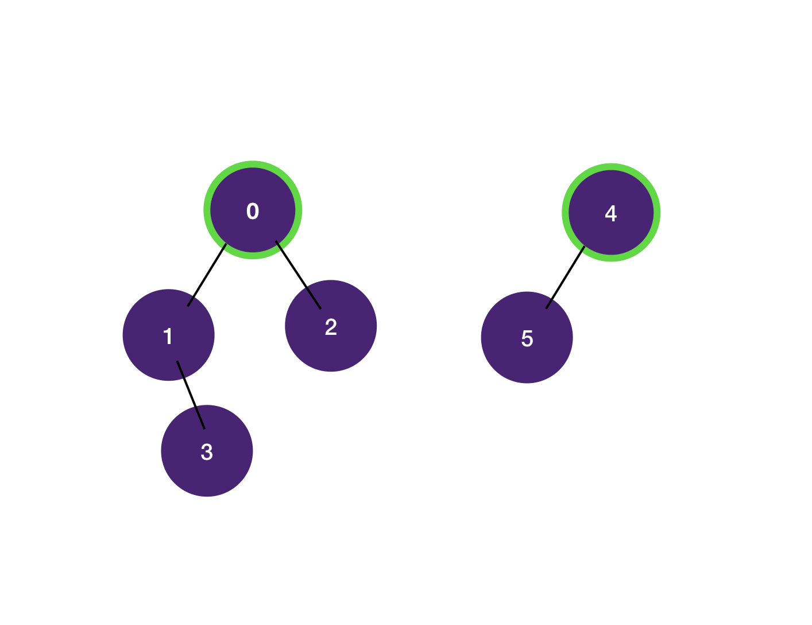
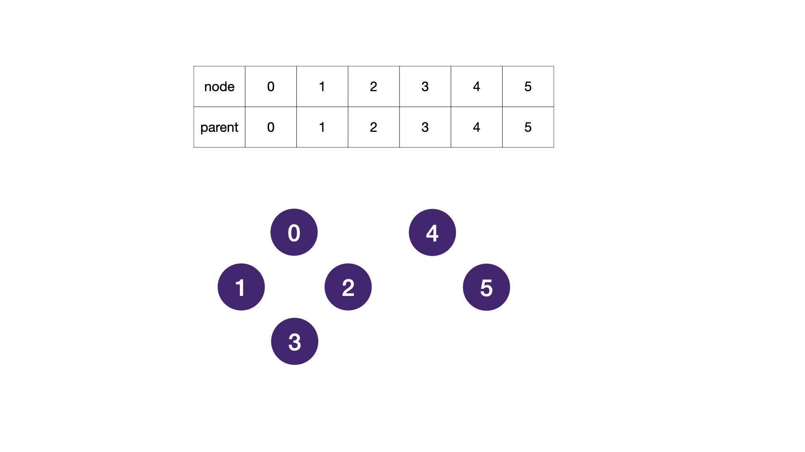
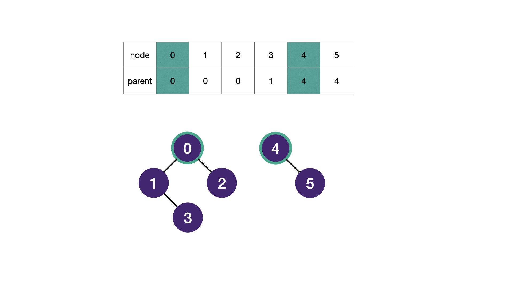
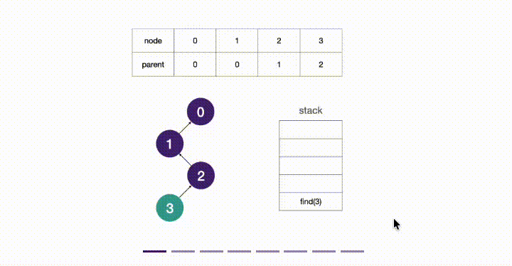

# Union Find | Disjoint Set Union Data Structure Introduction

Once we have a strong grasp of recursion and Depth First Search, we can now introduce Disjoint Set Union (DSU).

This data structure is motivated by the following problem. Suppose we have sets of elements and we are asked to check if a certain element belongs to a particular set. In addition, we want our data structure to support updates as well through merging two sets into one set.

Our data structure must support the following operations

* query for the Set ID of a given element (find operation)
* merge two disjoint sets into one set (union operation)

Note that the set ID is an unique identifier that helps us identify the disjoint sets.

Our goal is to construct a data structure that handles both the merge and query operations efficiently in O(1) time. A very straightforward implementation is to use a list of hashsets to store the disjoint sets; however, merging two hashsets takes O(n) time. To improve the runtime of the merging operation, we need to consider data structures that merges in O(1) time. We can easily merge two trees together in O(1) time if there is no restriction on how many children a node has, so we could employ a tree-like structure.

We can imagine the disjoint set data structure as a series of trees, where each tree denotes a set, such that an element in a tree (set) belongs solely to that tree (set) and no other trees (sets). The following graphic illustrates this idea.



## Implementation
How do we construct the tree structure to maintain disjoint sets?

We nominate a particular node to be the root of the tree, and this node will act as an identifier for all nodes within the tree. This identifier is the assigned set ID. We know that if two nodes share the same root, they must belong to the same set. Furthermore, if they don't, they belong in different (disjoint) sets. We can easily assign a parent to a node by using a hashmap, where the key is the node and the value is its parent. Initially, we set every node's parent to itself, as every node is in a set by itself. Then, we can merge two sets by setting one node's parent to the other node's parent, as this joins the two nodes into one tree. This way, we can find the set ID of a node by recursively moving up the tree until we reach the root (the node whose parent is itself). The following code accomplishes a Find operation that has best case O(1), average case O(log(n)) since we have a randomized trees which have average depth O(log(n)) and a worst case of O(n) for a maximum depth tree.

Let's see an example on how merging is performed. Given 6 disjoint nodes, perform operations: merge 3 1, merge 1 0, merge 5 4, merge 2 0. Recall that this will be done in our program with the union function.

Initially, we have 6 disjoint nodes, each node is its own parent (set ID):


* After merge 3 1, we set the parent of 3 to be 1, so 3 and 1 belong to the same set:
* After merge 1 0, we set the parent of 1 to be 0, so 0, 1 and 3 belong to the same set:
* After merge 5 4, we set the parent of 5 to be 4, so 4 and 5 belong to the same set:
* After merge 2 0, we set the parent of 2 to be 0, so 0, 1, 2 and 3 belong to the same set:
* Finally, we have two disjoint sets: {0, 1, 2, 3} and {4, 5}.
* First Set ID: 0, second Set ID: 4, where the set ID is the root of the tree.



```Java
public static class UnionFind<T> {
    // initialize the data structure that maps the node to its set ID
    private HashMap<T, T> id = new HashMap<>();

    // find the set ID of Node x
    public T find(T x) {
        // get the value associated with key x, if it's not in the map return x
        T y = id.getOrDefault(x, x);
        // check if the current node is a Set ID node
        if (y != x) {
            // set the value to Set ID node of node y
            y = find(y);
        }
        return y;
    }

    // union two different sets setting one Set's parent to the other parent
    public void union(T x, T y) {
        id.put(find(x), find(y));
    }
}
```

## Tree Compression Optimization

Now that we have a general idea of the data structure and how it is implemented, let's introduce an optimization. Imagine a scenario where our tree is not particularly balanced. In this case, the find operation may be quite slow (recursion depth is deep). For each node, if we could shorten the path to the root, then the runtime of the next find operation would be drastically cut down. We can do this by setting the parent of each node in this path to the root directly. We retrieve the Set ID when we reach the root, then as we return to a previous recursive stacks, we can set the parent of each node to the root node (same as Set ID value). After this restructure, the parent of all nodes in the same tree will be set to the root. Here is a graphic to demonstrate this idea and should be a good visual indication of why this technique is referred to as tree compression as we eventually reach a tree with depth of 2 after querying every node.

Assume we have a chain of 4 nodes as shown below. We will go through the details of the call find(3).



```Java
public static class UnionFind<T> {
    // initialize the data structure that maps the node to its set ID
    private HashMap<T, T> id = new HashMap<>();

    // find the Set ID of Node x
    public T find(T x) {
        // Get the value associated with key x, if it's not in the map return x
        T y = id.getOrDefault(x, x);
        // check if the current node is a Set ID node
        if (y != x) {
            // set the value to Set ID node of node y
            y = find(y);
            // change the hash value of node x to Set ID value of node y
            id.put(x, y);
        }
        return y;
    }

    // union two different sets setting one Set's parent to the other parent
    public void union(T x, T y) {
        id.put(find(x), find(y));
    }
}
```

## Disjoint Set Union Applications
The Disjoint Set Union data structure is a powerful tool that can be applied to a variety of problems, particularly those involving connectivity and grouping. Some common applications include:
1. **Connected Components in Graphs**: DSU can be used to find connected components in an undirected graph. By performing union operations for each edge, we can group nodes into their respective components.
2. **Kruskal's Algorithm for Minimum Spanning Tree**: DSU is used in Kruskal's algorithm to efficiently check if adding an edge would form a cycle. If the two vertices of the edge belong to different sets, we can safely add the edge and perform a union operation.
3. **Dynamic Connectivity**: DSU can be used to maintain information about the connectivity of a graph as edges are added or removed. This is particularly useful in scenarios like social networks or network connectivity.
4. **Percolation Theory**: In physics and materials science, DSU can be used to model percolation processes, where we want to determine if a fluid can flow through a porous material. By treating the material as a grid and using DSU to track connected components, we can determine if there is a path for the fluid to flow from one side to the other.


