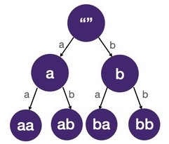

# Backtracking Template

## Combinatorial search problems
Combinatorial search problems involve finding groupings and assignments of objects that satisfy certain conditions. Finding all permutations, combinations, subsets, and solving Sudoku are classic combinatorial problems. The time complexity of combinatorial problems often grows rapidly with the size of the problem. Feel free to go back to the math basics section for a review.

The algorithm we use to solve a combinatorial search problem is often called backtracking.

## Backtracking == DFS on a tree
In combinatorial search problems, the search space (a fancy way of saying all the possibilities to search) is in the shape of a tree. The tree that represents all the possible states is called a state-space tree (because it represents all the possible states in the search space).

Below are the state-space trees for all 2-letter words composed using only 'a' and 'b':




Each node of the state-space tree represents a state we can reach in a combinatorial search (by making a particular combination). Leaf nodes are the solutions to the problem. **Solving combinatorial search problems boils down to DFS on the state-space tree.** Since the search space can be quite large, we often have to "prune" the tree, i.e. discard branches and stop further traversals. This is why it's often called backtracking.

### Difference between previous DFS problems and backtracking
If you had followed the content in order, you would have gone through quite a few DFS-on-tree problems. The main difference between those problems and the backtracking problems is that in backtracking, we are not given a tree to traverse but rather we construct the tree/ generate the edges and tree nodes as we go. At each step of a backtracking algorithm, we write logic to find the edges and child nodes. This may sound abstract but I promise it’ll be much clearer once we start seeing a couple of problems.

## How to implement a backtracking algorithm
Draw the tree, draw the tree, draw the tree!!!
Draw a state-space tree to visualize the problem. A small test case that's big enough to reach at least one solution (leaf node). We can't stress how important this is. Once you draw the tree, the rest of the work becomes so much easier - simply traverse the tree depth-first.

When drawing the tree, bear in mind:

* how do we know if we have reached a solution?
* how do we branch (generate possible children)?

Then, apply the following backtracking template:

```
    function dfs(start_index, path):
        if is_leaf(start_index):
            report(path)
            return
        for edge in get_edges(start_index):
            path.add(edge)
            dfs(start_index + 1, path)
            path.pop()
```

start_index is used to keep track of the current level of the state-space tree we are in.

edge is the choice we make; the string a, b in the above state-space trees.

The main logic we have to fill out is

* is_leaf
* get_edges

which correspond to the two questions above.

Notice how very similar this is to the Ternary Tree Path code we've seen in DFS with States module. That problem has an explicit tree. For combinatorial search problems, we have to find our own tree.

Note that the is_leaf and get_edges helper functions can be just one line of code, in which case it wouldn't be necessary to separate into another function.

## Time and space complexity
We visit each node of the state-space tree exactly once, so the time complexity of a backtracking algorithm is proportional to the number of nodes in the state-space tree. The number of nodes in a tree can be calculated by multiplying number of children of each node ^ height of the tree.

The space complexity of a backtracking algorithm is typically the height of the tree because that's where the DFS recursive call stack is of maximum height and uses the most memory.

## Example
Refer [CombinatorialSearchProblem.java](CombinatorialSearchProblem.java) for an example implementation of the backtracking template.

## Summary
Backtracking is one of the most headache-inducing category of interview questions. Now that you've seen it, it isn't too bad, right? It becomes mechanical once you master tree drawing and applying the template. Also did I tell you backtracking + memoization = dynamic programming? aka the hardest category of interview questions. Crazy how far we've come. In the next few sections, we will gradually evolve the basic template we have as we add more complexity.