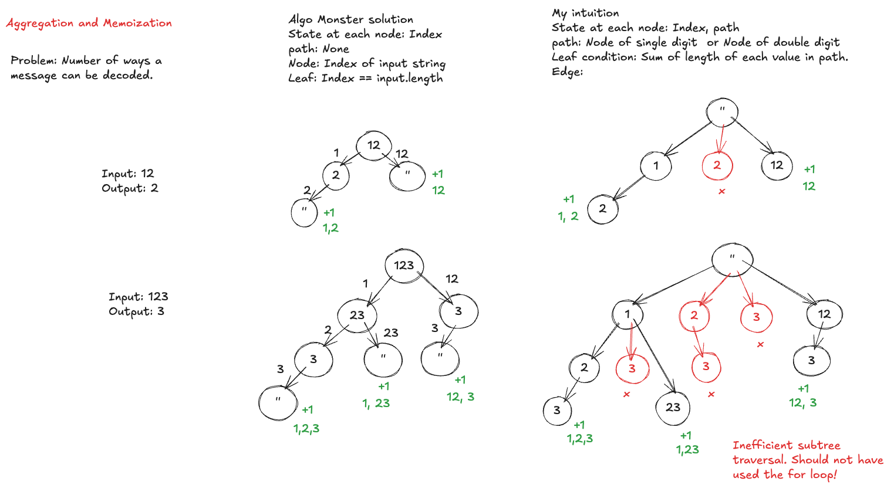
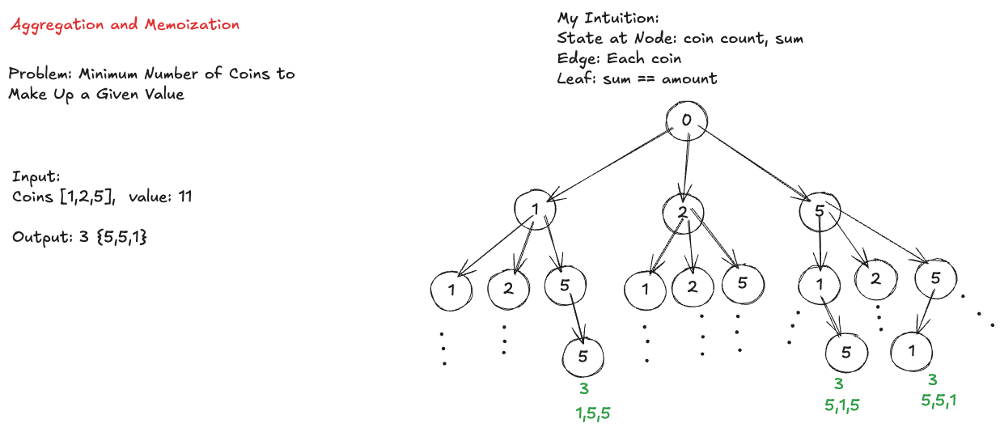
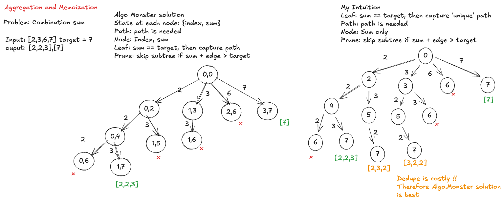

# 🧠 Backtracking: Abstract Thinking Playbook

``Goal: Solve unseen problems under pressure by modeling decisions, not memorizing patterns.``

## 1️⃣ What Backtracking Really Is

Backtracking is **not** about:

* generating all answers

* recursion tricks

* templates

Backtracking is about:

``Identifying what is undecided, and deferring everything else.``

## 2️⃣ The Only Question That Matters

When you see a problem, ask:

`` “What is undecided right now?” ``

Examples:

* Subsets → inclusion of current element
* Combination Sum → take or skip current candidate
* Palindrome Partitioning → commit substring or extend
* Restore IP → choose next valid segment

If you can answer this, you have the problem.

## 3️⃣ One Recursion Level = One Decision

Before writing code, you must be able to say:

``“At this recursion level, I decide ___.”``

Rules:

* One verb

* One decision

* Plain English

🚫 If you need two verbs → overcomplicated

🚫 If you mention size/count/length → premature decision

## 4️⃣ Delay Structural Decisions (Critical)

Do **not** pre-decide:

* subset size

* number of segments

* partition lengths

* order of results

These are emergent properties, not decisions.

``If something can emerge naturally from recursion, don’t pass it as a parameter.``

## 5️⃣ Allowed Branching Types (Only Two)

Every correct backtracking problem reduces to:

### A) Binary decision

* include / exclude

* take / skip

* commit / extend

### B) Iterative choice

* choose one valid option from a set

🚨 If you invent a third type → abstraction leak.

## 6️⃣ Decisions vs Pruning (Very Important)
🟢 Delay decisions that define structure

* What to choose

* How many

* Which one works

🔴 Prune states that violate possibility

Pruning answers:

``“Can any future choice succeed from here?”``

Examples of safe pruning:

* too many segments already chosen

* not enough characters left

* sum already exceeds target

* violates hard constraints

``Pruning removes impossible states.``

``Decisions explore possible states.``

They are not opposites.

## 7️⃣ The Invariant First, Base Case Second

Always write (or say) the invariant:

`“path represents a valid partial solution for ___.”`

Then the base case becomes obvious.

Example:
```
  Palindrome Partitioning 
  Invariant: path partitions s[0..start-1] into palindromes
  Base case: start == s.length()
```

If the base case feels complex → invariant is unclear.

## 8️⃣ Prefer Single-Index Recursion (Default)

When possible:

* Use one index to represent “what’s undecided”

* Use a loop to enumerate choices

Rule of thumb:

``If an index exists only to try longer options, it belongs in a loop — not recursion state.``

Two-index recursion is valid, but higher cognitive load.

## 9️⃣ Backtracking Template (Mental, Not Code)
    backtrack(state):
        if state is complete:
        record result
        return

        for each valid choice from this state:
            apply choice
            backtrack(next state)
            undo choice


If your solution doesn’t fit this shape, pause and simplify.

## 🔟 Under-Pressure Grounding Ritual (30 seconds)

When stuck in interviews:

* What is undecided?

* What can I safely delay?

* What is the smallest honest decision?

This interrupts panic and restores abstraction.

## 1️⃣1️⃣ Common Red Flags (Self-Debugging)
    
    🚨 Passing size/count as parameters
    🚨 Branching on future values (idx+1) instead of decisions
    🚨 Multiple recursion meanings at same level
    🚨 “Handling” invalid cases instead of preventing them

If you see these → stop and compress.

## 1️⃣2️⃣ Final Mantras (Memorize These)

    Backtracking is about deciding when to commit, not what the final answer looks like.
    
    Delay structural decisions. Prune impossible states.
    
    Abstract thinking is calmer, not faster.

## 1️⃣3️⃣ How to Practice (Daily Drill)

For any new problem (no coding yet):

1. Write one sentence for recursion level

2. List the allowed decisions

3. State the invariant

If you can do this, coding is mechanical.

---

# Backtracking Categories

## Combinatorial Search

## Backtracking with Pruning

## Backtracking with Additional States

## Aggregation and Memoization


### 1. [NumberOfWaysToDecodeAMessage.java](D_AggregationAndMemoization/NumberOfWaysToDecodeAMessage.java)


### 2. [MinNumberOfCoinsToMakeupAGiveValue.java](D_AggregationAndMemoization/MinNumberOfCoinsToMakeupAGiveValue.java)


### 3. [CombinationSum.java](D_AggregationAndMemoization/CombinationSum.java)
