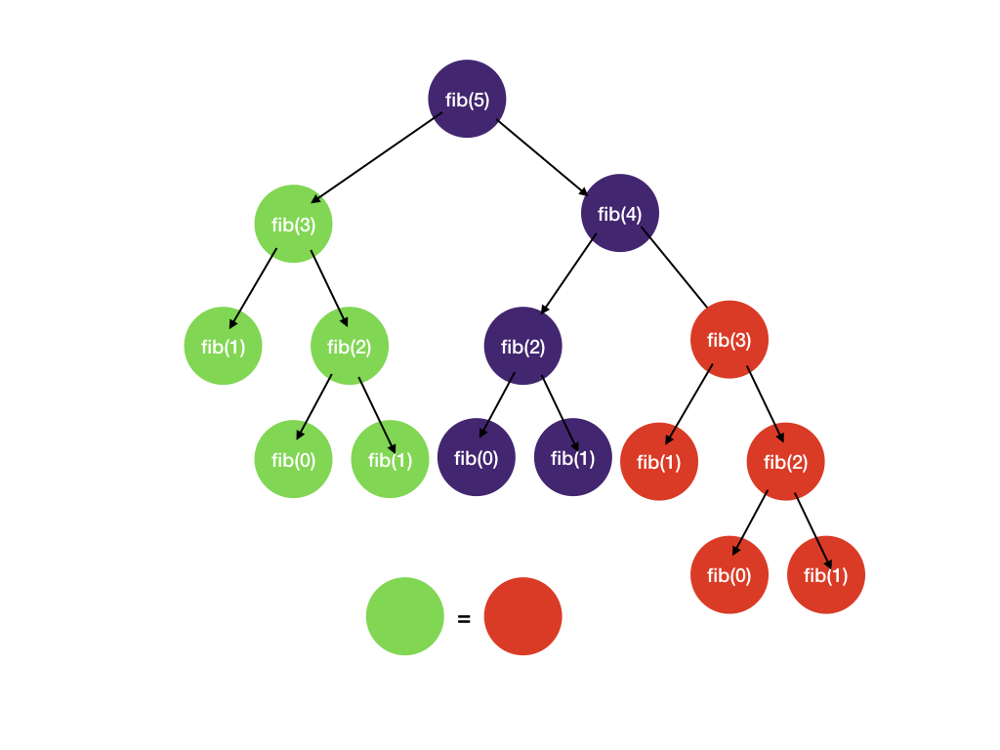

# Memoization

Memoization is a fancy word for a simple concept (so is the case for a lot of things we learn in school). It means saving the previous function call result in a dictionary and reading from it when we do the exact same call again. And no I didn't spell it wrong. The word is meant to mean writing down on a "memo".

A classic example is calculating Fibonacci number.

```java
int fib(int n) {
    if (n == 0 || n == 1) {
        return n;
    }
    return fib(n - 1) + fib(n - 2);
}
```

This results in a lot of repeated computations



The solution is simply saving previous results in a map of function arguments to results (the "memo"), checking it, and returning previous results if it has been done before. Otherwise, we carry out the computation and save the results in the map.

```java
int fib(int n, int[] memo) {
    // check in memo, if found, retrieve and return right away
    if (memo[n] != 0) return memo[n];

    if (n == 0 || n == 1) return n;

    int res = fib(n - 1, memo) + fib(n - 2, memo);

    // save result to memo before returning
    memo[n] = res;
    return res;
}
```

## When to memoize
After you draw the state-space tree, if you see duplicate subtrees, then it might be a good time to consider memoization.

## What to memoize
Think about the duplicate subtrees, what attribute(s) do they share? In the Fibonacci example, the duplicate subtrees have the same n value. Usually, the key to the memo is the start_index or any additional states that may appear multiple times during the recursion.

## Time Complexity Analysis
The benefit of memoization is that we store the obtained information in our memo so that we can access it in constant time.

The time to do backtracking is proportional to the number of nodes in the state-space tree. However, with memoization, we avoid duplicate subtrees (e.g. the red subtrees in the 2nd and 3rd slides). Therefore, the actual number of nodes visited is proportional to the size of the memo array.

For the above Fibonacci example, the size of the memo is O(n) (space complexity) and for each node we do O(1) work to combine the results from child recursive calls. Therefore the overall time complexity is O(n).

Memoization is particularly useful for combinatorial problems that have large repeated state-space tree branches. We will see that in the next module.