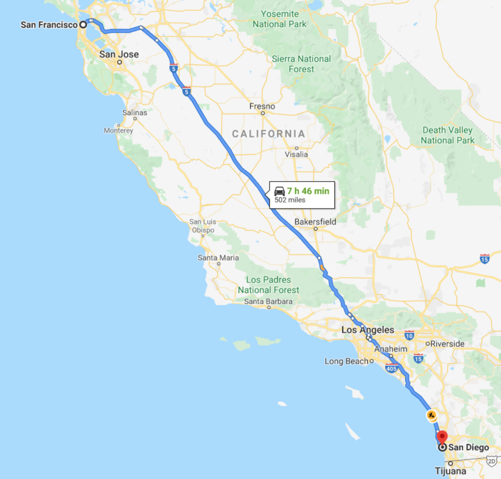
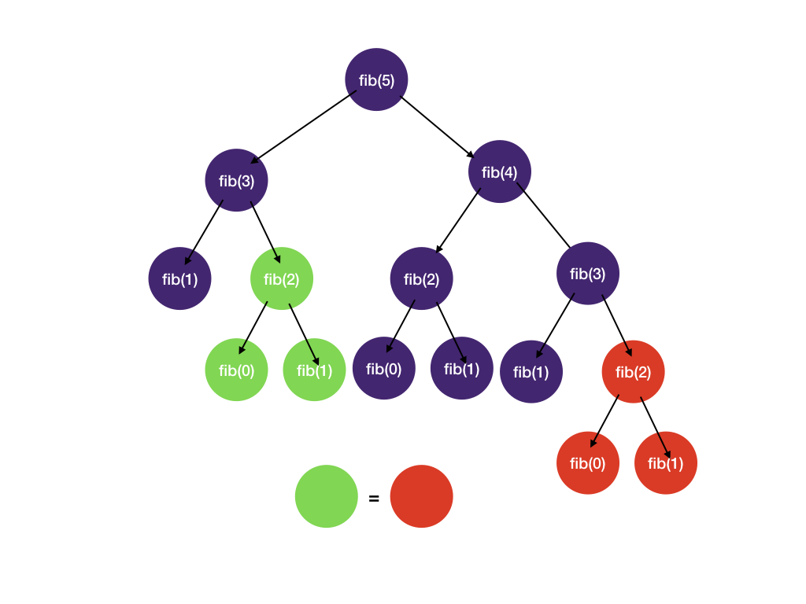
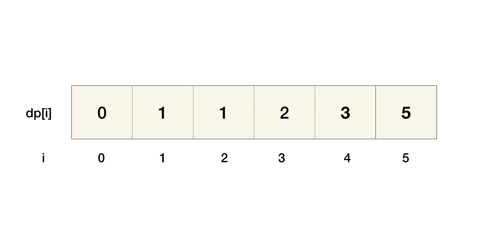

# What is Dynamic Programming?
Prerequisite: DFS, Backtracking, Memoization, Pruning

Dynamic programming is an algorithmic optimization technique that breaks down a complicated problem into smaller 
overlapping sub-problems in a recursive manner and uses solutions to the sub-problems to construct a solution to the 
original problem.

### Name Origin
"Dynamic programming, what an awfully scary name. What does it even mean? What’s so “dynamic” about programming?

The name was invented by Richard Bellman in the 1950s when computers were still in their infancy. By “programming” he 
did NOT mean programming as coding at a computer. Bellman was a mathematician, and what he really meant by programming 
was “planning” and “decision making”.

```
Trivia time: according to Wikipedia, Bellman was working at RAND corporation, and it was hard to get mathematical 
research funding at the time. To disguise the fact that he was conducting mathematical research, he phrased his research 
in a less mathematical term, “dynamic programming”. “Bellman chose the word dynamic to capture the time-varying aspect 
of the problems and because it sounded impressive. The word programming referred to the use of the method to find an 
optimal program, in the sense of a military schedule for training or logistics.”
```

So he really meant “multistage planning”, a simple concept of **solving bigger problems using smaller problems while 
saving results to avoid repeated calculations.** That sounds awfully familiar. Isn’t that memoization? Yes, it is. 
Keep on reading.

## Characteristics of Dynamic Programming

---
A problem is a dynamic programming problem if it satisfies two conditions:

1. The problem can be divided into sub-problems, and its optimal solution can be constructed from optimal solutions of the 
sub-problems. In academic terms, this is called [optimal substructure](https://en.wikipedia.org/wiki/Optimal_substructure).

2. The sub-problems from #1 overlap.

### 1. Optimal substructure
Consider the problem of the shortest driving path from San Francisco (SF) to San Diego (SD). Since the highway goes 
through Los Angeles (LA), the problem can be divided into two sub-problems - driving from SF to LA and driving from 
LA to SD.

In addition, **shortest_path(SF, SD) = shortest_path(SF, LA) + shortest_path(LA, SD)**. 
Optimal solution to the problem = combination of optimal solutions of the sub-problems.



Now let’s look at an example where the problem does NOT have an optimal substructure. Consider buying the cheapest 
airline ticket from New York (NYC) to San Francisco (SF). Let’s assume there is no direct flight, and we must transit 
through Chicago (CHI). Even though our trip is divided into two parts, NYC to CHI and CHI to SF, **usually the cheapest 
ticket from NYC to SF != the cheapest ticket from NYC to CHI + the cheapest ticket from CHI to SF** because airlines do 
not generally price multi-leg trips as the sum of each flight's cost to maximize profit.

### 2. Overlapping sub-problems
As we have seen in the 'memoization' technique, Fibonacci number calculation has a good amount of repeated computation 
(overlapping sub-problems) whose results can be cached and reused.



If the two conditions stated above are satisfied, then dynamic programming can solve the problem.

## DP == DFS + memoization + pruning

---
You might have seen posts on the coding forum titled “simple DFS solution” and “0.5 sec DP solution” for the same 
problem. It is because the two methods are equivalent. There are two different approaches to DP: top-down and bottom-up.

It's important to mention that pruning is an integral part of the process to cut down run time. We have seen state-space 
tree branch pruning in the backtracking section. We will see how it's applied in the following Knapsack section.

## How to Solve Dynamic Programming Problems?

---
Top-down: This is basically DFS + memoization, as we have seen in the memoization section. We split large problems and 
recursively solve smaller sub-problems.

Bottom-up: We try to solve sub-problems and then use their solutions to find the solutions to bigger sub-problems. This 
is usually done in a tabular form.

Let’s look at a concrete example.

## Fibonacci

---
Let's revisit the Fibonacci number problem from the memoization section.

## Top-down with Memoization

---
Recall that we have a system for backtracking and memoization.

* Draw the tree: see the tree above

* Identify states

* What state do we need to know if we have reached a solution? We need to know the value of n we are computing.
* What state do we need to decide which child nodes to visit next? No extra state is required. We always visit n-1 and n-2.
* DFS + pruning (if needed) + memoization
```Python
def fib(n, memo):
if n in memo: # check for the solution in the memo, if found, return it right away
return memo[n]

    if n == 0 or n == 1:
        return n

    res = fib(n - 1, memo) + fib(n - 2, memo)

    memo[n] = res # save the solution in memo before returning
    return res
```

## Bottom-up with Tabulation

---
For bottom-up dynamic programming, we first want to start with the sub-problems and work our way up to the main problem. 
This is usually done by filling up a table.

For the Fibonacci problem, we want to fill a one-dimensional table dp, where each entry at index i represents the value 
of the Fibonacci number at index i. The last element of the array is the result we want to return.

The order of filling matters because we cannot calculate dp[i] without dp[i - 1] and dp[i - 2].



Fibonacci dynamic programming
```Python
def fib(n):
    dp = [0, 1]
    for i in range(2, n + 1):
    dp.append(dp[i - 1] + dp[i - 2])

    return dp[-1]
```
## sub-problems and Recurrence Relation

---

The formula dp[i] = dp[i - 1] + dp[i - 2] is called the recurrence relation. It is the key to solving any dynamic 
programming problem.

For the Fibonacci number problem, the relation is already given dp[i] = dp[i - 1] + dp[i - 2]. We will discuss the 
patterns of recurrence relation in the next section.

## Should I do top-down or bottom-up?

---

Top-down pros:

* The order of computing sub-problems doesn't matter. For bottom-up, we have to fill the table in order to solve all the sub-problems first. For example, to fill dp[8], we have to have filled dp[6] and dp[7] first. For top-down, we can let recursion and memoization take care of the sub-problems and, therefore, not worry about the order.
* Easier to reason about partition type of problems (e.g., how many ways are there to..., split a string into...). Just do DFS and add memoization.

Bottom-up pros:

* Easier to analyze the time complexity (since it's just the time to fill the table)
* No recursion, and thus no system stack overflow—although not a huge concern for normal coding interviews.

From our experiences, top-down is often a better place to start unless it's clear what order the states should be filled in (e.g. grid dp problems).

## When to use dynamic programming

---

Mathematically, dynamic programming is an **optimization** method on one or more **sequences** (e.g., arrays, matrices). 
So questions asking about the optimal way to do something on one or more sequences are often a good candidate for 
dynamic programming. Typically, dynamic programming problems will ask for one of the following:

* The maximum/longest, minimal/shortest value/cost/profit you can get from doing operations on a sequence.
* How many ways there are to do something. This can often be solved by DFS + memoization, i.e., top-down dynamic programming.
* Is it possible to accomplish something? Often this kind of problem will ask you to return a boolean.

## Greedy Algorithm vs. Dynamic Programming

---
What is a greedy algorithm? As the name suggests, it is an algorithm where we always want to choose the best answer. 
Similar to dynamic programming, greedy algorithms also mainly solve optimization problems. Thus, it might be difficult 
to deduce whether the optimization problem actually uses greedy or dynamic programming.

The main difference between a greedy algorithm and dynamic programming is that the answer to a dynamic programming 
problem is not always necessarily the best answer for every state. This can be due to other restrictions in the problem, 
which may indicate we don't always want to pick the best answer. The only way you can really distinguish between the two 
is to check whether or not a greedy solution works by testing a few ideas. If you can reason with logic or 
counterexamples why some greedy approaches aren't optimal, then the solution will most likely be dynamic programming.

To get a better sense or idea of when greedy is actually applicable, you can check out [this article](this article).

## Divide and Conquer vs. Dynamic Programming

---
Both Divide and Conquer and dynamic programming break the original problem down into multiple sub-problems. 
The difference is that in dynamic programming, the sub-problems overlap, whereas in divide and conquer, they don't.

Consider Merge Sort, the sub-arrays are sorted and merged, but the sub-arrays do not overlap. Now consider Fibonacci; 
the green and red nodes in the "overlapping sub-problems" overlap.

## How to Develop Intuition for Dynamic Programming Problems

---

As you may have noticed, the concept of DP is quite simple—find the overlapping sub-problems, solve them, and use the 
sub-problem solutions to find the solution to the original problem. The hard part is to know how to find the recurrence 
relation. To best way to develop intuition is to get familiar with common patterns. Some classic examples include 
longest common subsequence (LCS), 0-1 knapsack, and longest increasing subsequence (LIS).

## Dynamic Programming Patterns

---
Here's the breakdown. We also highlighted the keywords that indicate it's likely a dynamic programming problem.

### Constant Transition
In constant transition DP, we process elements one by one, and each state dp[i] depends on a fixed number of previous 
states (e.g., dp[i-1], dp[i-2]). This gives O(n) total time.

* Climbing Stairs - number of ways to climb n stairs taking 1 or 2 steps at a time
* House Robber - find the maximum amount you can rob without robbing adjacent houses
* Min Cost Climbing Stairs - find the minimum cost to reach the top of the stairs

### Grid
The state in this type of DP is often the grid itself. Usually, dp[i][j] means max/min/best value for matrix cell ending 
at index i, j. It could also represent the answer to the problem but on the top-left i by j grid instead of the entire 
grid.

* Robot unique paths - number of ways for robot to move from top left to bottom right
* Unique Paths II - same as above but with obstacles in the grid
* Min path sum - find path in a grid with minimum cost
* Maximal square - find maximal square of 1s in a grid of 0s and 1s
* Dungeon Game - find minimum initial health to reach bottom-right (reverse DP direction)

## Dual-Sequence
This type of problem has two sequences in its problem statement. The problem will ask you to calculate some value 
related to both sequences. For these problems, typically the sub-problems will be to solve the problem on two new 
sequences seq1 and seq2, where seq1 is a prefix of the original first sequence and seq2 is a prefix of the original 
second sequence. Let's assume the sequences have lengths n and m, respectively. The state is 2D, so the memory 
complexity will typically be O(nm) and the time complexity will be O(nm) or worse. Here, dp[i][j] represents the 
max/min/best value for the first sequence ending in index i and the second sequence ending in index j.

* Longest common subsequence - find the longest common subsequence that is common in two sequences
* Edit distance - find the minimum distance to edit one string to another
* Delete String - determine the minimum cost required to delete characters
* Distinct Subsequences - count the number of ways to form target string from source
* Shortest Common Supersequence - find the shortest string containing both sequences as subsequences

## Interval
The key to solving this type of problem involves finding a sub-problem defined on an interval dp[i][j]. The main problem 
asks to calculate some value based on the whole array. The sub-problems will be typically to solve the same problem on a 
subarray, hence the name "interval". Since there's O(n^2) subarrays in an array, this DP will have O(n^2) states.

* Longest Palindromic Subsequence - find the longest palindromic subsequence in a string
* Coin game - two players play a game by removing coins from either end of a row of coins. Find the maximum score.
* Festival game, bursting balloons - similar to the coin game problem but with a different way of evaluating scores.

## Knapsack
This is the most common type of DP problem and an excellent place to get a feel of dynamic programming and how it's 
different from brute force backtracking. The state in these problems is a two-variable pair instead of the 
single-variable state we have seen so far in backtracking. For this category of DP problems, we usually introduce an 
additional state, which can be thought of as the "weight" we have so far in our knapsack.

* Knapsack - given a number of items of different weights, is it possible to use the items to make up weight X?
* Partition an array into two equal sum subsets - is it possible to divide an array into two subsets with equal sum?
* Target Sum - count the number of ways to assign +/- signs to reach a target sum
* 0-1 Knapsack - same as weight-only knapsack except items have values, and the goal is to find the maximum object value we can put in our knapsack without exceeding the allowed weight.

## Topological Sort DP
When the problem involves a directed acyclic graph (DAG) structure, we can use topological ordering to determine the DP 
evaluation order. The DAG can be explicit (given as edges) or implicit (derived from problem constraints like increasing 
values in a matrix).

* Longest Increasing Path in a Matrix - find the longest increasing path in a matrix (implicit DAG)
* Longest String Chain - find the longest chain of words where each word differs by one character

## Tree DP
In tree DP, we define states on tree nodes and compute solutions by combining results from child subtrees. The traversal 
is typically post-order (solve children first, then parent).

* House Robber III - find the maximum amount you can rob from a binary tree without robbing adjacent nodes

## Non-constant Transition
In these problems, dp[i] depends on a variable number of previous states rather than a fixed few. For example, 
dp[i] = max(dp[j]...) for j from 0 to i-1. Each state requires checking potentially all previous states, making the 
transition O(n) instead of O(1).

* Longest Increasing Subsequence - find the longest increasing subsequence of an array of numbers
* Buy/sell the stock with at most K transactions - maximize profit by buying and selling stocks using at most K transaction
* Divisor game - Return True if and only if James wins the game

## Bitmask
These DP problems use bitmasks to reduce factorial complexity (n!) to 2^n by encoding the dp state in bitmasks.

* Longest Path in a DAG - find the longest path in a directed acyclic graph.
* Minimum Cost to Visit Every Node in a Graph - find the minimum cost to traverse every node in a directed weighted graph
