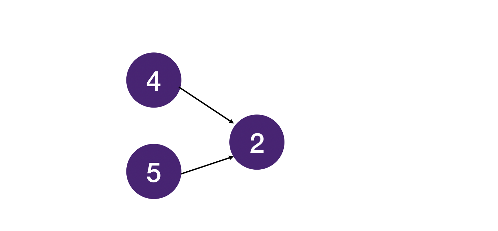
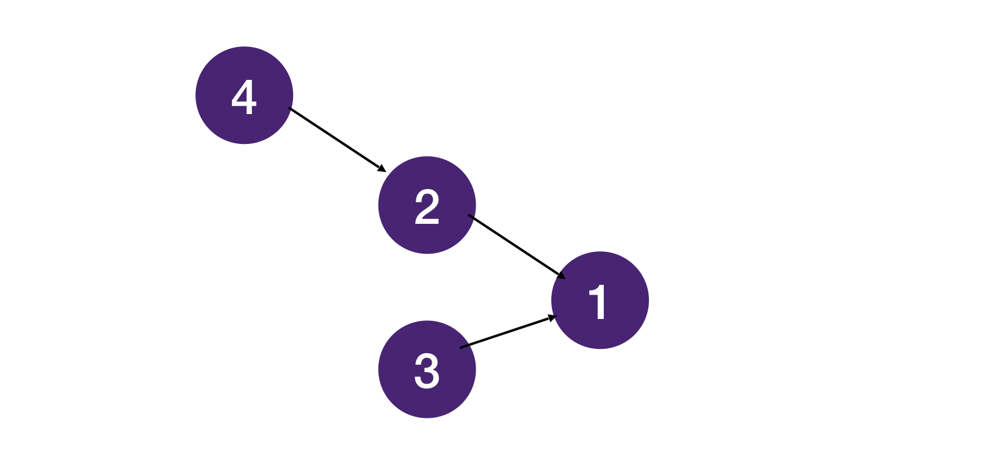
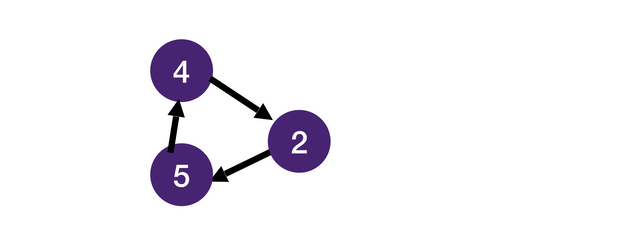
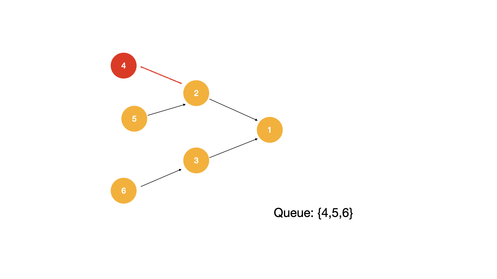

# Topological Sort | Topological Order
Prereq: Breadth First Search Review

## Directed Graph
Before we get started on topological order, let's talk about directed graphs first. A graph is directed when its edges have directions (these edges are also called arcs). Suppose that v, w are vertices in a directed graph. Let's get familiar with a few concepts.

* in-edge - an edge pointing to or coming into the node
* out-edge - an edge pointing away or going out from the node (we will refer those nodes on the other end of the out-edges of v to v's neighbors)
* in-degree - the number of in-edges coming into the node
* out-degree - the number of out-edges going out from the node
* dependency - "v depends on w" / "v is dependent on w" means that there is a directed path from w to v where v, w are vertices in a directed graph. With these new terms under our belt, it will make more sense when we talk about directed graphs.

## What is a topological order?
Topological sort or topological ordering of a directed graph is an ordering of nodes such that every node appears in the ordering before all the nodes it points to. Topological sort is not unique. For example, for a graph like this



Both [4, 5, 2] and [5, 4, 2] are valid topological sort.

And for the following graph:



Task 3 is completely independent of task 2 and 4, and it can be anywhere in the order as long as it is before task 1 which depends on it. All of the following ordering are valid topological orderings.

[4, 2, 3, 1], [4, 3, 2, 1], [3, 4, 2, 1]

## Graphs with Cycles Do Not Have Topological Ordering


It should be obvious that if a graph with a cycle does not have a topological ordering. In the above example, 2 has to come before 5 which has come before 4 which has to come before 2 which has to come before 5... which is impossible.

Circular dependency is a common problem in real-world software engineering. If you have experience with web development, you probably have seen dreaded errors like these 😅:


## Kahn's Algorithm
To obtain a topological order, we can use Kahn's algorithm which is very similar to Breadth First Search.

In order to understand why we must use this algorithm we first look at the problem it is trying to solve.

Given a directed graph does there exist a way to remove the nodes such that each time we remove a node we guarantee that no other nodes point to that particular node?

For this algorithm, we systematically remove one node at a time, each time removing a node such that no other nodes point to that node (in-degree is 0). If no such node exists, then there must be a cycle, and there is no way to order the nodes such that "every node appears in the ordering before all the nodes it points to" (no solution). After removing the current node, for each neighboring node the current node points to, we check whether any nodes point to this node. If there isn't any, we push this node into the queue. Notice it is important to keep track of the number of nodes pointing to a node (in-degree) in the question as we only push the node into the queue once all nodes the current node depended on have been removed. Here is a graphic to demonstrate the idea.




Let's summarize the steps here:

1. Initialize a hashmap to store the in-degrees.
2. Go through the nodes, count the in-degree of each node.
3. Push the nodes with 0 in-degree into the queue.
4. Pop each node from the queue, subtract 1 from the in-degree of each of its neighbors (each node it points to).
5. If a node's in-degree drops to 0, then push it into the queue.
6. repeat until the queue is empty. If any nodes remain unprocessed, then there must be a cycle.

## Topological Sort vs BFS
Notice the topological sort algorithm is very similar to BFS. The main difference is that we only push nodes with 0 in-degree into the queue in topological sort whereas in BFS we push all the neighboring nodes into the queue.

## Topological Sort Implementation in Python, Java, Javascript and C++
Similar to BFS, we keep things short and clear by separating the logic into functions find_indegree (step 1) and topo_sort (step 2-5).

```java
// find the indegree of a node by adding in-edge count
public static <T> Map<T, Integer> findInDegree(Map<T, List<T>> graph) {
    Map<T, Integer> inDegree = new HashMap<>();
    graph.keySet().forEach(node -> {
        inDegree.put(node, 0);
    });
    // loop through every node and add 1 in-edge count to its neighbors
    graph.entrySet().forEach(entry -> {
        for (T neighbor : entry.getValue()) {
            inDegree.put(neighbor, inDegree.get(neighbor) + 1);
        }
    });
    return inDegree;
}

// topological sort the list
public static <T> List<T> topoSort(Map<T, List<T>> graph) {
    // return a list of the topological sorted list
    List<T> res = new ArrayList<>();
    // make a queue that we will use for our solution
    Queue<T> q = new ArrayDeque<>();
    // loop through all nodes and add all nodes that have 0 in-degree
    Map<T, Integer> inDegree = findInDegree(graph);
    inDegree.entrySet().forEach(entry -> {
        if (entry.getValue() == 0) {
            q.add(entry.getKey());
        }
    });
    // perform bfs with queue, mostly the same as template bfs
    while (!q.isEmpty()) {
        T node = q.poll();
        // add node to list to keep track of topological order
        res.add(node);
        for (T neighbor : graph.get(node)) {
            // subtract one from every neighbour
            inDegree.put(neighbor, inDegree.get(neighbor) - 1);
            // once the in-degree reaches 0 you add it to the queue
            if (inDegree.get(neighbor) == 0) {
                q.add(neighbor);
            }
        }
    }
    // check for cycle
    return (graph.size() == res.size()) ? res : null;
} 
 ```
